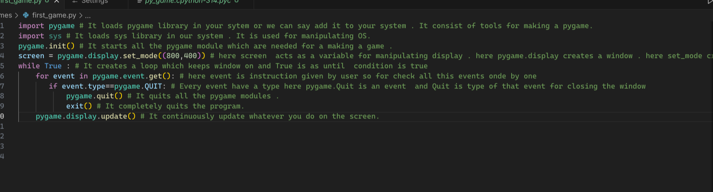
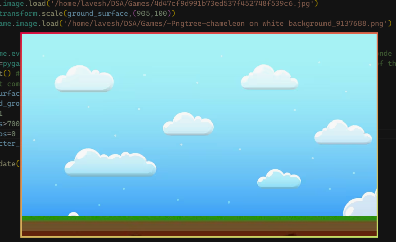

## pygame

DAY-1) 

It is my first pygame.this is day-1 progress

---
 
---
Day -2)

This is day 2 progress ,today i learnt about how to add image , learnt about screen.blint , how to scale images and many more.

---
